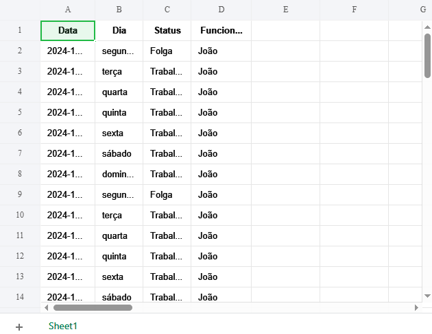

# Gerador de Escala de Trabalho 

[]()
[]()
[]()

## 📖 Sobre o projeto

O **Gerador de Escala de Trabalho** é uma aplicação de linha de comando desenvolvida em Python para automatizar a criação de escalas semanais e exportar o resultado para uma planilha Excel.

Esta é a primeira versão do sistema de geração de escalas de trabalho. O projeto foi criado para automatizar regras utilizadas em ambientes operacionais e serviu como base conceitual para a evolução posterior do **Workshift Manager**, uma solução mais completa com interface gráfica.

A aplicação demonstra automação de processos com Python, manipulação de datas, configuração por argumentos de linha de comando e geração de arquivos `.xlsx`.

## ✨ Funcionalidades

- Geração automática de escalas semanais;
- configuração de uma folga semanal fixa;
- aplicação da regra de domingos 2x1:
  - trabalha em dois domingos consecutivos;
  - folga no terceiro domingo;
- geração automática do período a partir da data inicial e da quantidade de semanas;
- personalização pelo nome do colaborador;
- exportação automática da escala para `escala.xlsx`;
- configuração por parâmetros de linha de comando.

### Parâmetros

| Parâmetro | Descrição | Exemplo |
| --- | --- | --- |
| `--nome` | Nome do colaborador | `João` |
| `--inicio` | Data inicial da escala | `2026-01-01` |
| `--semanas` | Quantidade de semanas | `4` |
| `--folga` | Dia da folga semanal fixa | `segunda` |

Após a execução, o arquivo `escala.xlsx` fica disponível para consulta, compartilhamento, impressão ou uso operacional.

## 🖼️ Screenshots

A imagem abaixo apresenta uma escala gerada pela aplicação:

<p align="center">
  
</p>

## 🚀 Tecnologias

- **Python:** implementação da aplicação e processamento das regras;
- **Pandas:** manipulação dos dados da escala;
- **OpenPyXL:** geração do arquivo Excel.

## ⚙️ Como executar

### Pré-requisitos

- Python 3.9 ou superior;
- pip.

### Clonar o repositório

```bash
git clone https://github.com/archivesysl/escala-em-python-p-mercado.git
cd escala-em-python-p-mercado
```

### Instalar as dependências

```bash
pip install -r requirements.txt
```

Como alternativa, as bibliotecas podem ser instaladas manualmente:

```bash
pip install pandas openpyxl
```

### Execução padrão

```bash
python "./Projeto_EscalaDeTrabalhov1/main.py"
```

### Execução com parâmetros personalizados

```bash
python "./Projeto_EscalaDeTrabalhov1/main.py" \
--nome "João" \
--inicio 2026-01-01 \
--semanas 4 \
--folga segunda
```

Ao final da execução, a aplicação gera automaticamente o arquivo `escala.xlsx`.

## 📂 Estrutura do projeto

A estrutura mantém o script, as dependências, a documentação e a imagem de demonstração no mesmo diretório:

```text
Projeto_EscalaDeTrabalhov1/
├── main.py
├── escaladetrabalho.PNG
├── README.md
├── requirements.txt
└── escala.xlsx (gerado após execução)
```

- `main.py`: script principal da aplicação;
- `escaladetrabalho.PNG`: imagem de demonstração;
- `README.md`: documentação técnica;
- `requirements.txt`: dependências do projeto;
- `escala.xlsx`: planilha criada após a execução.

> A evolução do conceito para uma aplicação com interface gráfica deu origem posteriormente ao projeto Workshift Manager.

## 🌐 Deploy

O projeto é uma aplicação de linha de comando e não possui deploy web. Pode ser executado localmente em qualquer ambiente compatível com Python 3.9+ e com as dependências instaladas.

A distribuição consiste no código-fonte e no arquivo de dependências. Após a execução, a aplicação gera a planilha `escala.xlsx` para utilização operacional.

## 👤 Autor

**Natan Da Luz**

- LinkedIn: [linkedin.com/in/natandaluz](https://www.linkedin.com/in/natandaluz/)
- Portfólio: [portfolionatan.vercel.app](https://portfolionatan.vercel.app/)
- E-mail: [natandaluz01@gmail.com](mailto:natandaluz01@gmail.com)

## 📄 Licença

Este projeto está sem uma licença definida no momento.
